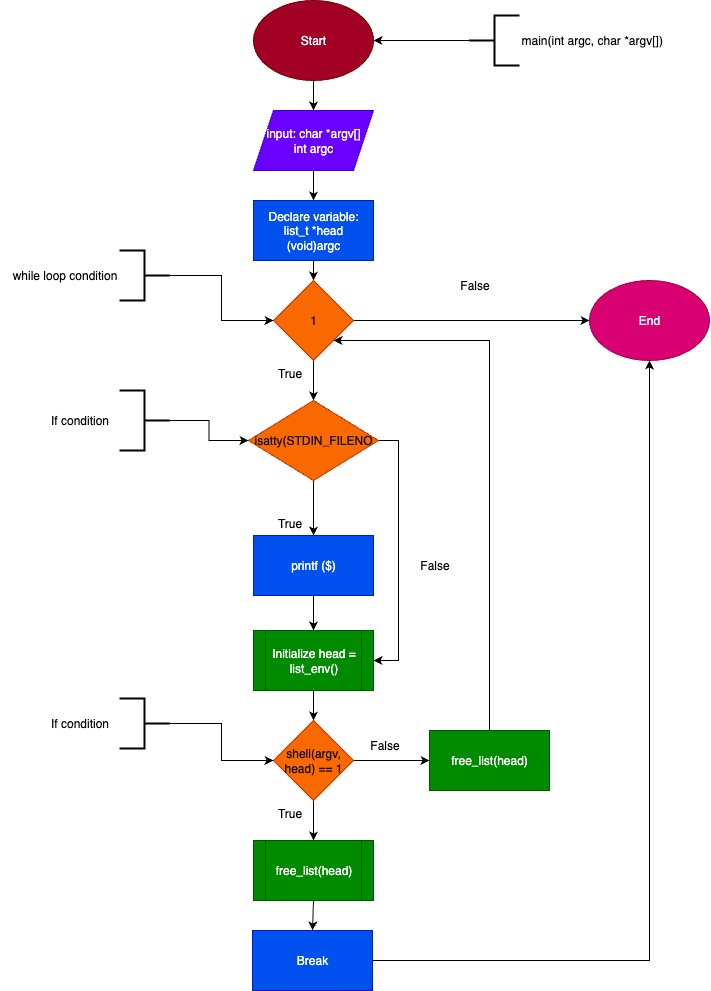

# **Project : Simple Shell**

## Description

In this project, we reproduced a mini-shell.<br>
This program creates child processes to access certain commands while keeping the parent process open and unchanged. The parent process waits for the child to close.<br>
We ensured that there are no memory leaks and no phantom children.<br>
A function scans the PATH to find executable files corresponding to the entered command and displays the expected result.<br>
This solution works for commands that are not built-in.<br>

## GitHub Link

([GitHub Pages](https://github.com/Saniez-l/holbertonschool-simple_shell))

## Features

- Execution of system commands : (`ls`, `pwd`, `echo`, etc.)

- Support for command arguments

- `exit` command to quit the shell

## Prerequisites

- Linux / macOS

- GCC or any compatible C compiler

## How to use

1. #### Clone the repository using the link above

2. #### cd holbertonschool-simple_shell

3. #### Compile using following command :

```c
gcc -Wall -Werror -Wextra -pedantic -std=gnu89 *.c -o hsh
```

4. #### Run the shell :<br>
./hsh

## Example of use
```bash
~/holbertonschool-simple_shell$ ./hsh
$ ls
main.c  header.h  shell.c
$ pwd
/home/user/holbertonschool-simple_shell
$ echo "Hello world"
Hello world
$ exit
```
## Structure of files
+ simple_shell.c                    &nbsp;&nbsp;&nbsp;&nbsp;&nbsp;&nbsp;&nbsp;&nbsp;&nbsp;&nbsp;&nbsp;&nbsp;&nbsp;&nbsp;&nbsp;      //main function
+ header.h                  &nbsp;&nbsp;&nbsp;&nbsp;&nbsp;&nbsp;&nbsp;&nbsp;&nbsp;&nbsp;&nbsp;&nbsp;&nbsp;&nbsp;&nbsp;&nbsp;&nbsp;&nbsp;&nbsp;&nbsp;&nbsp;&nbsp;            //header
+ .gitignore               &nbsp;&nbsp;&nbsp;&nbsp;&nbsp;&nbsp;&nbsp;&nbsp;&nbsp;&nbsp;&nbsp; &nbsp;&nbsp;&nbsp;&nbsp;&nbsp;&nbsp;&nbsp;&nbsp;           //file containing all the tests and executable files
+ README.md                 &nbsp;&nbsp;&nbsp;&nbsp;&nbsp;&nbsp;&nbsp;&nbsp;&nbsp;&nbsp;&nbsp;&nbsp;&nbsp;&nbsp;&nbsp;            //explanation of the project
+ hsh.1             &nbsp;&nbsp;&nbsp;&nbsp;&nbsp;&nbsp;&nbsp;&nbsp;&nbsp;&nbsp;&nbsp;&nbsp;&nbsp;&nbsp;&nbsp;&nbsp;&nbsp;&nbsp;&nbsp;&nbsp;&nbsp;&nbsp;&nbsp;&nbsp;&nbsp;&nbsp; //man page
+ getenv.c        &nbsp;&nbsp;&nbsp;&nbsp;&nbsp;&nbsp;&nbsp;&nbsp;&nbsp;&nbsp;&nbsp;&nbsp;&nbsp;&nbsp;&nbsp;&nbsp;&nbsp;&nbsp;&nbsp;&nbsp;&nbsp;    //4 function fo : get the environment && adds a new node && free a linked list && make all the directories of the environment in a list
+ fork.c         &nbsp;&nbsp;&nbsp;&nbsp;&nbsp;&nbsp;&nbsp;&nbsp;&nbsp;&nbsp;&nbsp;&nbsp;&nbsp;&nbsp;&nbsp;&nbsp;&nbsp;&nbsp;&nbsp;&nbsp;&nbsp;&nbsp;&nbsp;&nbsp;&nbsp;&nbsp;//2 function for : execute a path commande && fork shell
+ env.c          &nbsp;&nbsp;&nbsp;&nbsp;&nbsp;&nbsp;&nbsp;&nbsp;&nbsp;&nbsp;&nbsp;&nbsp;&nbsp;&nbsp;&nbsp;&nbsp;&nbsp;&nbsp;&nbsp;&nbsp;&nbsp;&nbsp;&nbsp;&nbsp;&nbsp;  //print the environement
+ body_shell.c   &nbsp;&nbsp;&nbsp;&nbsp;&nbsp;&nbsp;&nbsp;&nbsp;&nbsp;&nbsp;&nbsp;&nbsp;&nbsp; //program for enter command user
+ AUTHORS    &nbsp;&nbsp;&nbsp;&nbsp;&nbsp;&nbsp;&nbsp;&nbsp;&nbsp;&nbsp;&nbsp;&nbsp;&nbsp;&nbsp;&nbsp;&nbsp;  //autors page

## Flowchart




## Future improvements

Internal command support (cd, printf, etc.).

Operator management (;, &&, ||).

Redirections (>, <, etc).

## The rules we followed

+ Edition was made on VS code.
+ A functional README is present, you are actually enjoying it atm.
+ The codebase follows the Betty coding style. Every file ends with a new line and most of the files have less than 40 lines.
+ To improve readability of our files we put each different functions in a specific file.
+ All function prototypes can be viewed in the header file (main.h)
+ Appropriate include guards were implemented in all header files to prevent multiple inclusions.

## Authors
Mustapha Chermat<br>
Christophe Saniez-Lenthieul
